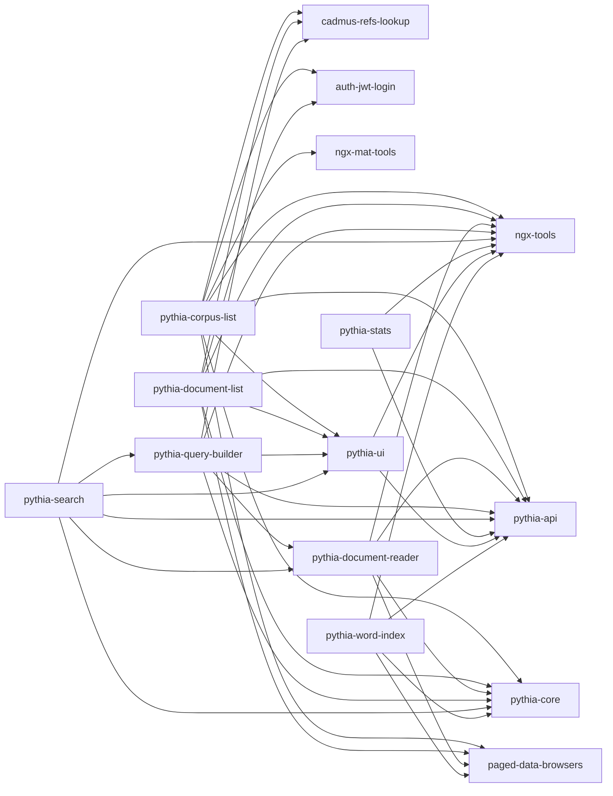

# Pythia Shell V2

This project was generated using [Angular CLI](https://github.com/angular/angular-cli) version 19.0.3.

This is version 2 of the Pythia UI development shell. Version 2 has been refactored into a standalone app, all its input/output endpoints have been refactored with signals, and all its library versions have bumped to 6.

>The old version (4) is being preserved in its [original repository](https://github.com/vedph/pythia-shell). An intermediate major version 5 is a deprecated intermediate version.

This shell is used to develop and test the basic UI components for building Pythia-based frontends like Minerva.

## Docker

🐳 Quick **Docker image build** (non-localized):

1. `npm run build-lib`;
2. update version in `env.js` (and in Docker compose scripts);
3. `ng build --configuration production`;
4. `docker build . -t vedph2020/pythia-shell:6.0.0 -t vedph2020/pythia-shell:latest`.

## Creation

The app has been created with these commands:

```bash
ng new pythia-shell
ng add @angular/material
ng add @angular/localize

ng g library @myrmidon/pythia-api --prefix pythia
ng g library @myrmidon/pythia-core --prefix pythia
ng g library @myrmidon/pythia-corpus-list --prefix pythia
ng g library @myrmidon/pythia-document-list --prefix pythia
ng g library @myrmidon/pythia-document-reader --prefix pythia
ng g library @myrmidon/pythia-query-builder --prefix pythia
ng g library @myrmidon/pythia-search --prefix pythia
ng g library @myrmidon/pythia-stats --prefix pythia
ng g library @myrmidon/pythia-ui --prefix pythia
ng g library @myrmidon/pythia-word-index --prefix pythia

npm i @myrmidon/auth-jwt-admin @myrenvmidon/auth-jwt-login @myrmidon/cadmus-refs-lookup @myrmidon/ngx-tools @myrmidon/ngx-mat-tools @myrmidon/paged-data-browsers ngx-echarts ts-md5 --force

npm i --save-dev ngx-i18nsupport
```

Then the old code has been progressively imported and refactored for standalone. Then, on a second refactoring pass all the decorator-based properties and events have been refactored to use signals.

## Dependencies



## History

- 2025-07-29: updated Angular and packages.

### 7.0.0

- 2025-06-03: ⚠️ upgraded to Angular 20.
- 2025-02-07:
  - added POS filter to word index (`@myrmidon/pythia-api`, `@myrmidon/pythia-word-index`).
  - updated Angular.
- 2025-01-29:
  - updated Angular and packages.
  - updated peer dependencies in libraries.
  - added view transitions.
- 2025-01-22: updated Angular.
- 2025-01-20: updated Angular.

### 6.0.2

- 2025-01-09:
  - updated Angular and packages.
  - 👉 removed direct import `import '@angular/localize/init';` and added `"types": ["@angular/localize"]` to the `tsconfig` file of each library using it. Note that to correctly work the localize package must be added to the `main.ts` as `/// <reference types="@angular/localize" />` and added to each consumer into its `tsconfig` types. The former is usually done by the `ng add @angular/localize` schematics.
- 2024-12-30: updated packages.

### 6.0.1

- 2024-12-29: updated packages.

### 6.0.0

- 2024-12-19:
  - updated Angular and packages.
  - removed `EnvServiceProvider`.
- 2024-12-16:
  - fixes to [ngx-echarts](https://github.com/xieziyu/ngx-echarts) usage for Angular 19. See sample code at <https://github.com/xieziyu/ngx-echarts-starter/blob/master/src/app/app.component.ts> for correctly importing dependencies in standalone with Angular 19.
  - updated Angular and packages.

📆 [previous history](https://github.com/vedph/pythia-shell)
